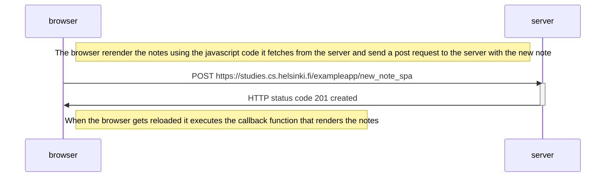

```mermaid
sequenceDiagram
    participant browser
    participant server


    Note right of browser: The browser rerender the notes using the javascript code it fetches from the server and send a post request to the server with the new note   
    browser->>server: POST https://studies.cs.helsinki.fi/exampleapp/new_note_spa
    activate server
    server->>browser: HTTP status code 201 created
    deactivate server 
    
    Note right of browser: When the browser gets reloaded it executes the callback function that renders the notes
```